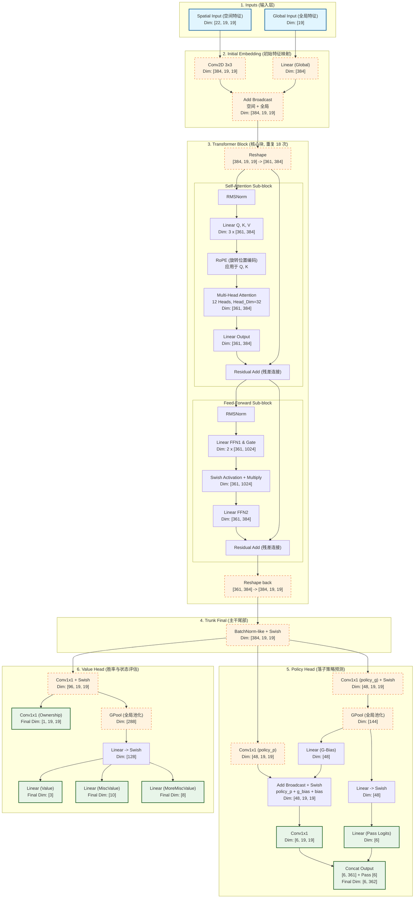

```mermaid
graph TD
    %% 样式定义
    classDef input fill:#e1f5fe,stroke:#01579b,stroke-width:2px;
    classDef block fill:#f3e5f5,stroke:#4a148c,stroke-width:2px;
    classDef head fill:#e8f5e9,stroke:#1b5e20,stroke-width:2px;
    classDef op fill:#fff3e0,stroke:#e65100,stroke-width:1px,stroke-dasharray: 5 5;

    %% ========== 1. 输入层 ==========
    subgraph Inputs ["1. Inputs (输入层)"]
        S_IN["Spatial Input (空间特征)<br>Dim: [22, 19, 19]"]:::input
        G_IN["Global Input (全局特征)<br>Dim: [19]"]:::input
    end

    %% ========== 2. 初始嵌入层 ==========
    subgraph Embedding ["2. Initial Embedding (初始特征映射)"]
        Conv3x3["Conv2D 3x3<br>Dim: [384, 19, 19]"]:::op
        LinearG["Linear (Global)<br>Dim: [384]"]:::op
        AddEmbed["Add Broadcast<br>空间 + 全局<br>Dim: [384, 19, 19]"]:::op
        
        S_IN --> Conv3x3
        G_IN --> LinearG
        Conv3x3 --> AddEmbed
        LinearG --> AddEmbed
    end

    %% ========== 3. Transformer Blocks (18次重复) ==========
    subgraph Transformer ["3. Transformer Block (核心块, 重复 18 次)"]
        direction TB
        ReshapeIn["Reshape<br>[384, 19, 19] -> [361, 384]"]:::op
        
        %% Attention 内部
        subgraph Attention ["Self-Attention Sub-block"]
            RMS1["RMSNorm"]
            QKV["Linear Q, K, V<br>Dim: 3 x [361, 384]"]
            RoPE["RoPE (旋转位置编码)<br>应用于 Q, K"]
            Attn["Multi-Head Attention<br>12 Heads, Head_Dim=32<br>Dim: [361, 384]"]
            ProjOut["Linear Output<br>Dim: [361, 384]"]
            AddAttn["Residual Add (残差连接)"]
            
            RMS1 --> QKV --> RoPE --> Attn --> ProjOut --> AddAttn
        end
        
        %% FFN 内部
        subgraph FFN ["Feed-Forward Sub-block"]
            RMS2["RMSNorm"]
            FFN1["Linear FFN1 & Gate<br>Dim: 2 x [361, 1024]"]
            SwishGLU["Swish Activation + Multiply<br>Dim: [361, 1024]"]
            FFN2["Linear FFN2<br>Dim: [361, 384]"]
            AddFFN["Residual Add (残差连接)"]
            
            RMS2 --> FFN1 --> SwishGLU --> FFN2 --> AddFFN
        end
        
        ReshapeOut["Reshape back<br>[361, 384] -> [384, 19, 19]"]:::op

        ReshapeIn --> RMS1
        ReshapeIn --> AddAttn
        AddAttn --> RMS2
        AddAttn --> AddFFN
        AddFFN --> ReshapeOut
    end

    AddEmbed --> ReshapeIn

    %% ========== 4. Trunk 尾部 ==========
    subgraph Trunk ["4. Trunk Final (主干尾部)"]
        BatchNorm["BatchNorm-like + Swish<br>Dim: [384, 19, 19]"]:::op
    end
    ReshapeOut --> BatchNorm

    %% ========== 5. 策略头 (Policy Head) ==========
    subgraph PolicyHead ["5. Policy Head (落子策略预测)"]
        direction TB
        PolConvP["Conv1x1 (policy_p)<br>Dim: [48, 19, 19]"]:::op
        PolConvG["Conv1x1 (policy_g) + Swish<br>Dim: [48, 19, 19]"]:::op
        
        GPoolPol["GPool (全局池化)<br>Dim: [144]"]:::op
        
        PolPass1["Linear -> Swish<br>Dim: [48]"]
        PolPassLogits["Linear (Pass Logits)<br>Dim: [6]"]:::head
        
        PolGBias["Linear (G-Bias)<br>Dim: [48]"]
        
        PolAdd["Add Broadcast + Swish<br>policy_p + g_bias + bias<br>Dim: [48, 19, 19]"]
        PolSpatialOut["Conv1x1<br>Dim: [6, 19, 19]"]:::head
        
        PolOutFinal["Concat Output<br>[6, 361] + Pass [6]<br>Final Dim: [6, 362]"]:::head
        
        BatchNorm --> PolConvP
        BatchNorm --> PolConvG
        PolConvG --> GPoolPol
        
        GPoolPol --> PolPass1 --> PolPassLogits
        GPoolPol --> PolGBias
        
        PolConvP --> PolAdd
        PolGBias --> PolAdd
        PolAdd --> PolSpatialOut
        
        PolSpatialOut --> PolOutFinal
        PolPassLogits --> PolOutFinal
    end

    %% ========== 6. 价值头 (Value Head) ==========
    subgraph ValueHead ["6. Value Head (胜率与状态评估)"]
        direction TB
        ValConv1["Conv1x1 + Swish<br>Dim: [96, 19, 19]"]:::op
        
        OwnOut["Conv1x1 (Ownership)<br>Final Dim: [1, 19, 19]"]:::head
        
        GPoolVal["GPool (全局池化)<br>Dim: [288]"]:::op
        ValH["Linear -> Swish<br>Dim: [128]"]
        
        ValOut["Linear (Value)<br>Final Dim: [3]"]:::head
        MiscOut["Linear (MiscValue)<br>Final Dim: [10]"]:::head
        MoreMiscOut["Linear (MoreMiscValue)<br>Final Dim: [8]"]:::head
        
        BatchNorm --> ValConv1
        ValConv1 --> OwnOut
        ValConv1 --> GPoolVal
        GPoolVal --> ValH
        
        ValH --> ValOut
        ValH --> MiscOut
        ValH --> MoreMiscOut
    end
```
